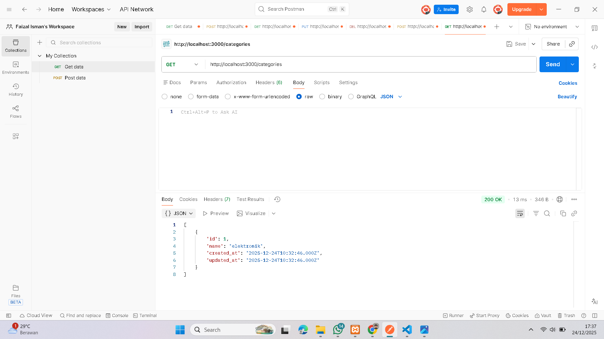
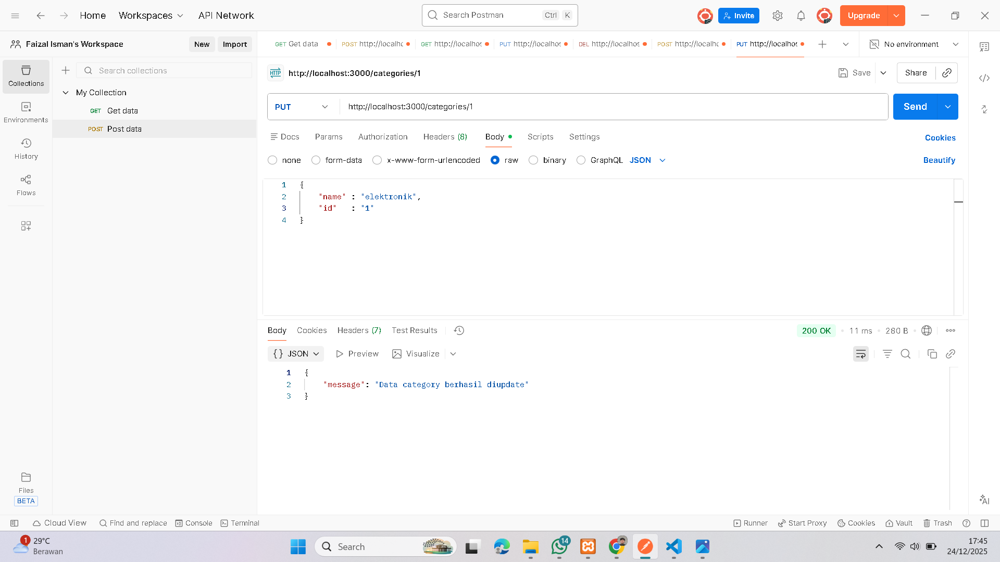
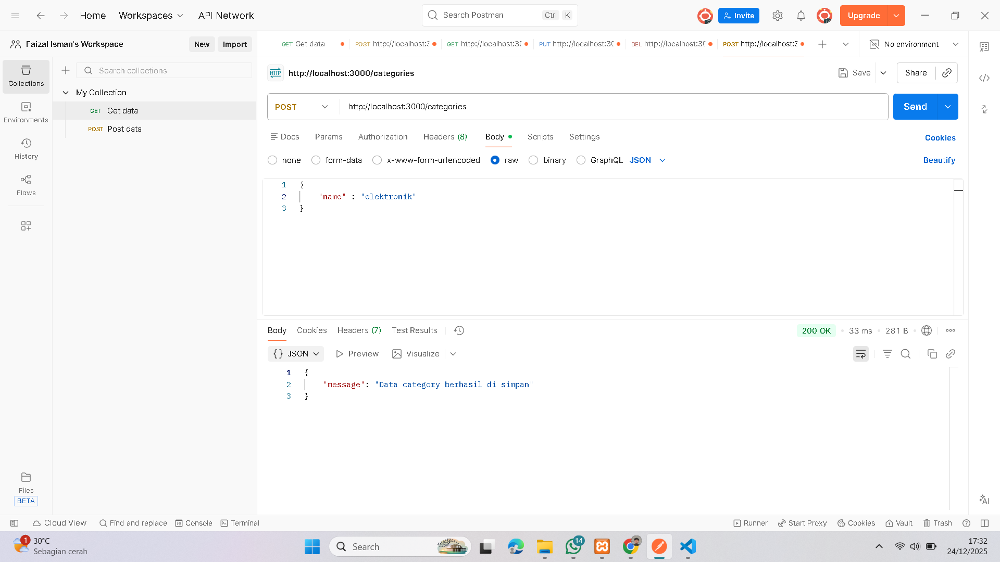
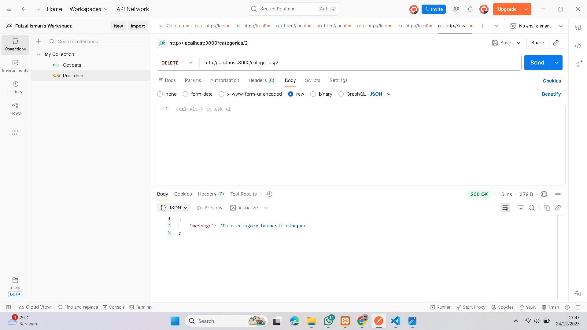
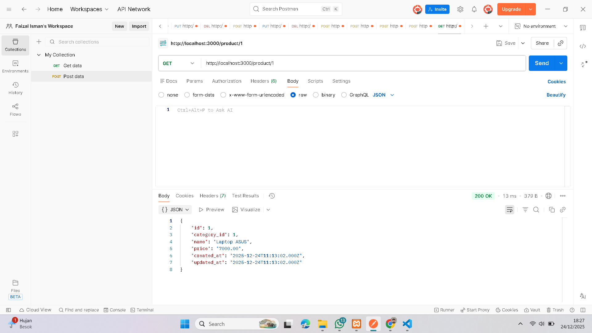
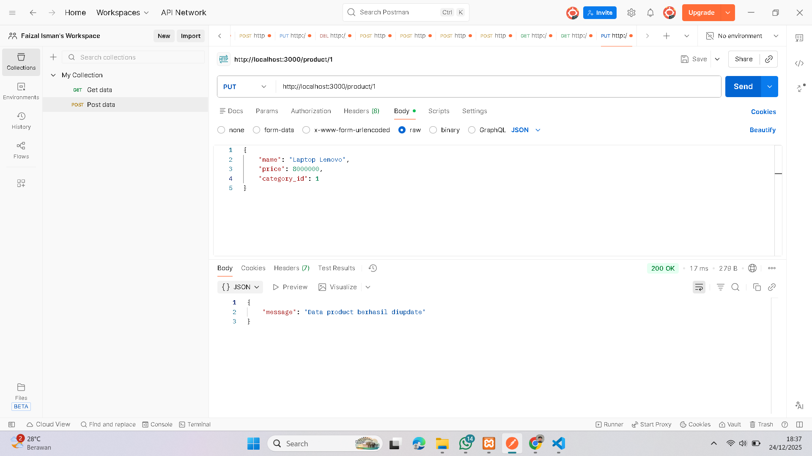
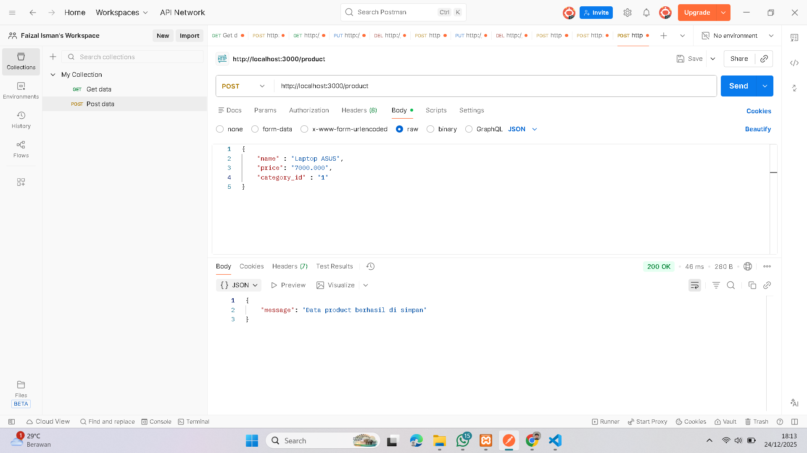
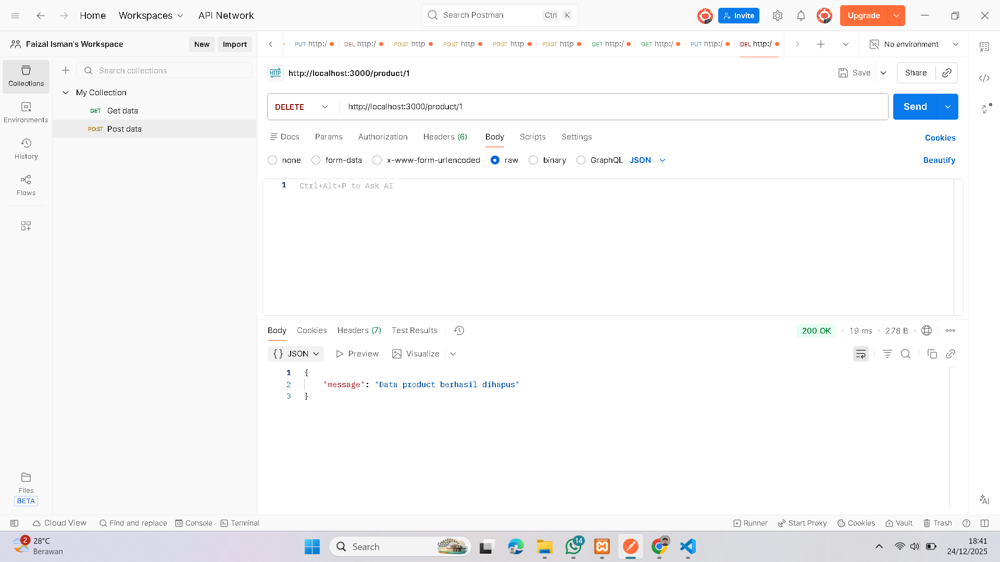

<h2>Step untuk menjalankan nya </h2>

Buka Xampp, kemudian start Mysql dan Apachenya
Selanjutnya clone poroject ini dan untuk menjalankannya ketik "npm run dev"
pastikan juga sudah terhubung dengan internet :)

Untuk link git 
https://github.com/Izalhaasclaw/nodejs-crud-restapi.git

<h2> Category </h2>
1. Menampilkan data berdasarkan id

2. Menampilkan data keseluruhan

3. Mengupdate data

4. Menyimpan data

5. Menghapus data

<h2> Product </h2>
1. Menampilkan data berdasarkan id

2. Menampilkan data keseluruhan

3. Mengupdate data

4. Menyimpan data

5. Menghapus data

